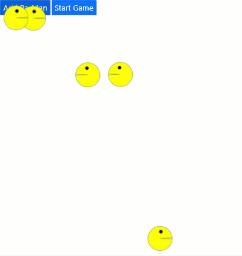

# PacMen-Exercise

> Version 1.0.0.1

A funny project to create PacMen that collide within the browser's limits

What is being **used** in this project:
- **Object Factory** to create the following PacMen
- **DOM** to detect the browser's boundaries
- **Buttons** to interact with the program

## How to use

1. Push the **"Add PacMan"** button to add a new PacMan to the window.
2. Push the **"Start Game"** button to make the PacMan move.
3. Keep pushing the **"Add PacMan"** button to add multiple PacMen.
4. Keep pushing the **"Start Game"** button to make them move faster.

## Improvements to come

- **Sounds** to add more fun

## Maintainers
Who worked on this:
- [Simon Capriles](https://simoncapriles.github.io/)

## Support

Found some issues?  
Write to this email: <a href="mailto:info@kyohei.com.bo"><i class="font-icon icon-envelope"></i>info@kyohei.com.bo</a>
